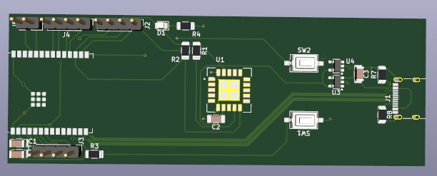
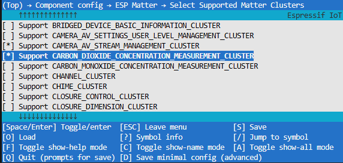
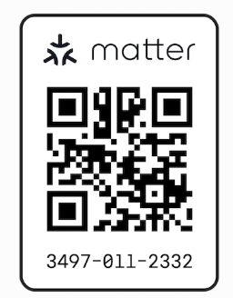
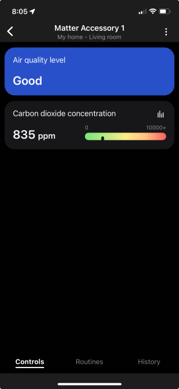
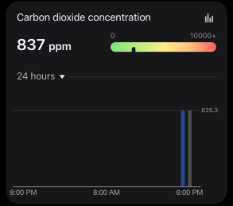

## Author: Daniel Abdi

# Introduction

This repo contains code and design files for building your own Matter-based CO2 air quality monitor. The design is based on an ESP32-C6 and SCD40 CO2 sensor, though you can probably replace the SCD40 with any of its cousins in the SCD4x family. It's capable of measuring CO2 in PPM, relative humidity, and the current temperature. Though I only make use of the CO2 measurement in this code. Modifications to add in that functionality are left as an excercise for the reader 😁.  Please note that I'm using ESP-IDF v5.4 and esp-matter at release/v1.4 when compiling. Also note that my code is frankly quite messy and it's doubtful that it adheres to best practices for setting these attributes. Might be worth it to fix later, but this whole project has been more for a fun excercise than anything else. 

I don't have 3D models of the C6 or the SCD40 so you'll have to use your imagination for those 😆

# How to use it

I make use of a custom board that I designed specifically for this project, so if you'd like to follow my example, you would either have to order a set of boards using the included KiCAD design files, or set up your own example using an ESP32-C6 devkit and a SCD4X breakout board. If you choose to go with your own solution, make sure you change the I2C pins set up within the Sensirion driver folder. I'm going to assume you're somewhat familiar with Matter, esp-matter, ESP-IDF, and KiCAD. Regardless, you should just be able to compile, flash, and pair using a Matter controller you have nearby (I use an Aeotec smart hub).

### Caution with ESP-Matter
 You should also note that depending on which commit of esp-matter you're using, you may run into issues using esp-matter to set the Air Quality value of the Air Quality cluster that is mandatory for the device. Currently, this cluster has a flag of `MANAGED_INTERNALLY`, which means that you need to use the underlying Attribute Accessor Interface (AAI) to set it. That's why those other air-quality-sensor-manager files are included in the repository. Those files are pulled straight from the example in the CHIP repository. If you find that you see an error message where you can't set the value of that attribute using the esp-matter APIs, uncomment the lines in app_main.cpp that represent AAI, and use those functions instead. You can still use esp-matter to set the CO2 concentration. There is also a patch [here](https://github.com/espressif/esp-matter/issues/1548) that you can try and use as well. This should remove that flag and allow you to use esp-matter. You will also need to enable the Air Quality and Carbon Dioxide Concentration clusters in menuconfig for esp-matter. 
 
 

### Pairing
To pair, please use the information at the esp-matter [docs](https://docs.espressif.com/projects/esp-matter/en/latest/esp32/developing.html#building-a-color-temperature-lightbulb). You can use the QR code there to pair to any esp-matter device you create. I've also included the pairing code here for your use.

Here's what it'll look like after pairing. 

# The Details

The main components of this project are the SCD4X drivers from Sensirion, included in the `/drivers` directory, and `app_main.cpp`, which contains all the code that we really care about. The Sensiron drivers are cloned from  [Here (Github)](https://github.com/Sensirion/embedded-i2c-scd4x/tree/master), with some modifications from my side to work with my custom code (basically adding in the I2C implementation and setting the right pins). I've also included some code from the CHIP repository that represents a way to access attributes using the Attribute Accessor Interface (AAI). Read above on when you might need to use this code, otherwise you can feel free to leave it alone. 

### Clusters
Currently, the device contains 2 clusters of importance to us: The Air Quality cluster, which is mandatory for an Air Quality device, and the CO2 concentration cluster. I've also added the CO2 concentration feature flag, instead of using a level-approach (Like a bad-moderate-good-etc scale) read more in the cluster definitions from the CSA to understand these feature flags and which might work for your use case. Upon commissioning into the Matter fabric, these values are updated every ~5 seconds. SmartThings will be helpful and show you an hourly average of the readings going back 24 hours, so you can see how the CO2 in a space changes over the course of a day or so, even when you aren't looking at the app.

 If you make a change to the features or clusters on the device, make sure to erase-flash, delete from your Matter app, and re-pair, otherwise they may not show up. 

### Using Thread
If you have a Thread border router, you can also enable Thread support and use Matter over Thread with the C6. I haven't done that because I'm not sure if my controller supports Thread and frankly in my use case it doesn't matter as it'd be the only Thread device on the network anyways. 

If you have any questions about my implementation or need help setting up your own, feel free to open an issue and I will try and help.